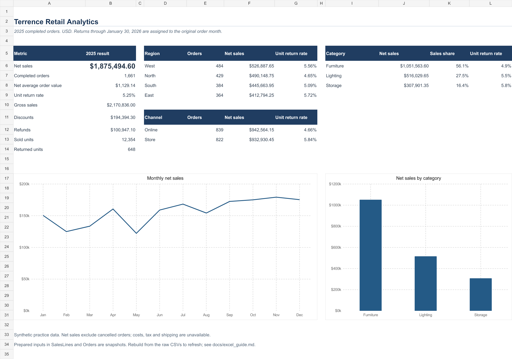

# Retail Sales and Returns Analytics

**Terrence Tambinaka Enow — Excel, Power Query and SQL Server portfolio practice**

An end-to-end analysis of **Harbor Home & Office**, a US retailer. Five shared CSV files contain realistic order, customer, product and return records with data quality issues. The project follows those records from raw inputs to a relational model, audited cleaning decisions and sales KPIs.

All business records are synthetic. Orders cover 2025; returns are observed through January 30, 2026. Amounts are USD.



## Results

| Metric | Result |
|---|---:|
| Net sales after discounts and returns | **$1,875,494.60** |
| Completed orders | **1,661** |
| Net average order value | **$1,129.14** |
| Sold units / returned units | **12,354 / 648** |
| Unit return rate | **5.25%** |

West had the most completed orders, **484**, and generated **$526,887.65** in net sales. Furniture supplied **56.1%** of annual net sales. May recorded the lowest monthly net sales, while November recorded the highest. These are observations within project data;. See [findings and recommended investigations](reports/findings.md).

## What this project demonstrates

- Power Query profiling, explicit date and number conversion, text standardization, duplicate review and rejection queries.
- A relational model with unique dimension keys and validated customer, order, product and return relationships.
- SQL Server all-text staging, typed loading, constraints, a calendar and record-level audit dispositions.
- CTEs, `ROW_NUMBER`, `DENSE_RANK`, `LAG`, running totals and a trailing three-month average.
- Excel formulas and editable native charts, with distinct order denominators and returns aggregated before line joins.
- Reproducible validation from the original CSVs, including tests for join expansion and invalid return quantities.

## Start here

1. Open [the Excel analysis workbook](excel/Terrence_Retail_Analysis.xlsx). Its formulas calculate financial measures from prepared line inputs and roll them into orders, months and the dashboard. [Excel guide](docs/excel_guide.md).
2. Review [metric definitions and the data model](docs/methodology.md).
3. Follow [SQL Server setup](docs/sql_setup.md), then run the five numbered files in `sql/` in order.
4. Use [practice exercises](practice/exercises.md) to repeat the work without reading the completed solutions first.

The [original Power Query practice workbook](excel/Terrence_Power_Query_Practice.xlsx) is also included as an unchanged copy. Its five clean table counts match, and its business values match the independent output after mapping Web/Retail channels and normalizing return-reason capitalization. The original contains Power Query and a Data Model; its saved file does not contain the later PivotTable or Calendar query. [Preservation and comparison evidence](checks/original_workbook_validation.json).

The Excel analysis uses documented snapshots derived from the shared raw files. Its ordinary worksheet formulas recalculate when existing inputs change. It does **not** refresh those snapshots through Power Query; the guide distinguishes this portable analysis file from the original hands-on Power Query workbook.

## Quality reconciliation

Every raw row is accounted for as accepted, an exact duplicate, or rejected. A negative quantity is rejected; it is never changed to a positive sale. Missing customer email is allowed.

| Table | Raw | Duplicate rows removed | Rejected | Clean |
|---|---:|---:|---:|---:|
| Customers | 304 | 4 | 0 | 300 |
| Products | 26 | 2 | 0 | 24 |
| Orders | 1,813 | 12 | 1 | 1,800 |
| Order lines | 4,476 | 25 | 5 | 4,446 |
| Returns | 339 | 3 | 1 | 335 |

The model retains 139 cancelled orders and their valid lines for audit. Sales KPIs exclude them. Returns have their own `return_id`; several valid return events can belong to one order line. Invalid events are removed before cumulative return quantities are checked, preserving legitimate events on the same line.

## Reproduce and verify

The independent Python companion requires Python 3.10+ and only its standard library:

```sh
python scripts/build_analysis.py
python -m unittest discover -s scripts -p 'test_*.py'
```

The first command reads `data/raw`, rebuilds clean and rejected outputs, produces the analytical CSVs and validates the fixed dataset against recorded checkpoints. Raw files remain unchanged. The second runs **13 regression tests**; the pipeline also passes **31 reconciliation checks**. Expected benchmarks are verification targets, not inputs to the analysis.

**Execution status:** The Python pipeline and tests have run successfully. The Excel output is calculated and checked with Artifact Tool; desktop Excel behavior has not been independently executed. SQL Server scripts are complete but **not execution-verified** because the local client could not establish its connection. `sql/05_validation.sql` must pass on the target SQL Server before claiming an executed SQL result. [Validation evidence](checks/README.md).

## Repository layout

```text
data/raw/          Original CSVs shared by Excel and SQL Server
data/clean/        Typed, normalized output with source row references
data/rejected/     Rejections and exact duplicates with reasons
sql/               Schema, import, cleaning, analysis and validation solutions
excel/             Analysis workbook and preserved Power Query workbook
analysis/          Inspectable facts and KPI summaries
images/            Dashboard preview
reports/           Findings and practical interpretation
docs/              Definitions, modeling, Excel and SQL instructions
practice/          Short exercises and answer checkpoints
scripts/           Independent cleaning/analysis pipeline and tests
checks/            Source hashes and execution/validation evidence
```

## Scope and limitations

Net sales are order-cohort sales after discounts and recorded refunds. They are not profit or a return-date cash ledger. Refunds use the original discounted unit price. Taxes, shipping, costs, targets and prior-year history are absent. Near-universal repeat purchasing is a feature of this  dataset, not evidence of customer loyalty. Category and product order counts overlap, so they cannot be added to obtain a unique total.

This project began as hands-on Excel cleaning and modeling project. Completed solutions and automated checks are included to make the work reviewable and reproducible; the exercises preserve opportunities to explain and rebuild the analysis.
