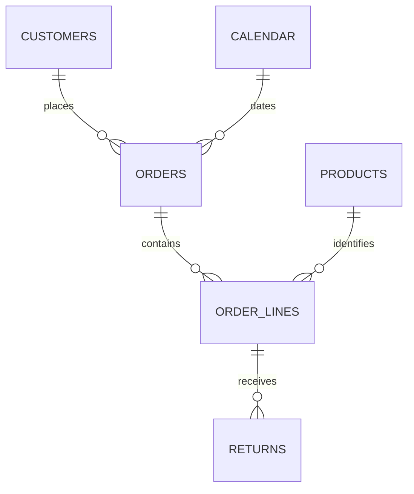

# Definitions and model

## Business scope

Harbor Home & Office is a fictional US retailer. All data was generated for skills practice, with seed `20260906`. `example.com` email addresses and customer names are synthetic. The five original raw CSVs are the shared source for both Excel practice and SQL Server. Keep these files unchanged.

Sales cover orders dated January 1–December 31, 2025 with status `Completed`. Returns through January 30, 2026 reduce their original order cohort. Cancelled orders remain in clean data but are excluded from every sales KPI. There are no tax, shipping or cost fields.

## Grain and keys

| Table | One row represents | Primary key | Parent references |
|---|---|---|---|
| Customers | Customer | customer_id | — |
| Products | Product | product_id | — |
| Orders | Order header | order_id | customer_id |
| Order lines | Individual product line on an order | order_line_id | order_id, product_id |
| Returns | Return event | return_id | order_line_id |
| Calendar | Calendar date in 2025 | Date | — |

The normalized model is a small snowflake. In Excel, filter from each unique parent key to the related child key. Calendar connects to **Orders.order_date**. A separate return-date calendar is needed for a cash/refund-date analysis; the order calendar deliberately covers 2025 only. Do not relate Returns to itself or assume it has `order_id`.

## Cleaning policy

1. Identify exact duplicate business records using all original business fields, excluding the added audit row number. Keep one and log the others. Distinct line IDs with the same order/product pair remain distinct.
2. Normalize text, spaces, region capitalization and status. Map `web` to Online and `retail` to Store. Customer email may be missing.
3. Parse dates explicitly as ISO `YYYY-MM-DD` or US `MM/DD/YYYY`. Reject impossible dates. Parse US numbers, currency and percentage text; `20%` means 0.20, and a decimal `0.20` also means 0.20.
4. Require positive whole-number quantities, positive prices and discounts from 0 to 1 inclusive. Quarantine conflicting key records instead of arbitrarily selecting one.
5. Validate parent keys in parent-before-child order.
6. Reject invalid individual returns first. Then compare cumulative otherwise-valid return units per line with purchased units. A failing cumulative group is quarantined for review.

The intentionally invalid rows are `OX0001`, `X000001`–`X000005` and `RX001`. Return `RX001` must be excluded while the legitimate return `R00001` on the same line survives. Python audit numbers and the SQL import helper both count the header as 1 and the first data record as 2. For CSVs with quoted newlines, this denotes a logical record number, not necessarily a physical text line number.

The provided SQL and Python implementations reproduce this fixed dataset. They are not universal validation libraries: SQL uses bounded decimal precision, permitted field lengths and SQL collation rules. New source formats, schemas or business rules require review and new tests.

## Measures

For completed orders, aggregate accepted returns to one returned quantity per order line **before** joining them to line sales.

| Measure | Definition |
|---|---|
| Gross sales | Sum(quantity × original unit price) |
| Discounts | Sum(quantity × original unit price × discount rate) |
| Sales before returns | Gross sales − discounts |
| Refunds | Sum(returned quantity × original unit price × (1 − discount rate)) |
| Net sales | Sales before returns − refunds |
| Completed orders | Distinct completed order IDs, including fully returned orders |
| Net AOV | Net sales / completed orders |
| Unit return rate | Returned units / sold units |
| Month-on-month growth | (Current month net sales − prior month net sales) / prior month net sales |
| Running net sales | Cumulative monthly net sales in date order |
| Trailing three-month average | Mean of current and previous two consecutive calendar months; blank until March |
| Repeat-customer sales share | Full-year net sales from customers with ≥2 completed 2025 orders / annual net sales |

Keep calculation precision and round only for display. A rate is a ratio of summed quantities, not an average of row percentages. Return rate is measured in units, not returned orders. Category/product distinct order counts overlap; their `aov` CSV field is allocated category/product net sales per participating order, not full-basket AOV.

January growth is undefined because no prior month is supplied. A zero prior-month denominator also produces no growth percentage. Monthly order counts and money can be summed; distinct customers across months cannot.
